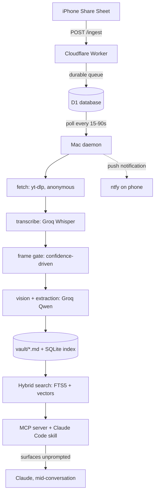
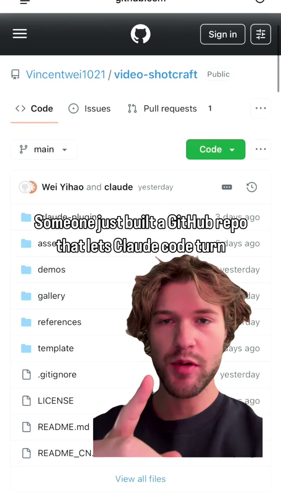

# Stash: turning a graveyard of saved Instagram posts into a knowledge base Claude actually uses

*A case study in building a personal RAG pipeline — the architecture, the prior-art
research, and five real bugs that only showed up when the system ran against real
data.*

---

## The problem

The idea started from a familiar failure mode. Scrolling Instagram, finding a reel
about a new agent-building technique or a useful open-source repo, saving it —
either to a Saved collection or by DMing it to a second personal account — with
every intention of coming back to it. Then never coming back to it.

The instinct is to blame the capture step: *if only sharing were one tap faster, I'd
actually use these.* That instinct is wrong, and figuring out why it's wrong is
most of what this project turned out to be about.

Capture was never the bottleneck. The share gesture already took under two
seconds and had been reliable for months. The actual failures were:

1. **The content was opaque.** A URL like `instagram.com/reel/C8xY...` tells you
   nothing. You can't search it, skim it, or judge whether it's worth 90 seconds
   of re-watching. So you don't.
2. **Retrieval required remembering you'd saved something in the first place.**
   Nothing surfaced a save when it became relevant. The entire reason you saved it
   — so you wouldn't have to hold it in your head — is the same reason you never
   thought to go dig it back up.

So the actual project isn't a bookmarking tool. It's a pipeline that makes saved
content **searchable by meaning** and **surfaces itself without being asked** —
retrieval-augmented generation applied to your own back catalog of "things I meant
to look into."

## What already existed

Before writing anything, the honest move was to check whether this was a solved
problem. It's closer to solved than expected, and further than assumed, in
specific and useful ways.

Twelve candidate projects were pulled apart — a mix of ones surfaced during
research and ones suggested mid-project — and two claims about them turned out to
be wrong on inspection:

- **The project that looked closest to the idea wasn't.** A creator-archival tool
  that bulk-downloads one account's entire output solves the opposite shape of
  problem — this project needed a curated stream from *many* creators, chosen by
  *you*, not everything from one source.
- **The Meta App Review requirement, as usually described, is half right and the
  expensive half.** App Review exists to let an app serve *other people's*
  Instagram accounts in production. For a single-user tool, a Meta app in
  Development Mode with the owner's own account as tester gets live DM webhooks
  indefinitely on Standard Access — no review, no business verification. That
  distinction is the difference between a webhook integration being a day of
  work versus a month of paperwork, and every write-up that skips it makes the
  DM-capture idea look far harder than it is.

The one gap nobody had actually built: **not one of the twelve had a capture
layer.** All twelve assumed you'd paste a URL in manually — the exact behavior
that produces a graveyard in the first place. That gap is what this project
actually had to build; everything else (transcription, vision, structured
extraction) had reference implementations worth borrowing ideas from, most
notably a confidence-gated frame-extraction technique from a smaller project:
transcribe first, and only pull video frames at the moments where the transcript
is uncertain or explicitly points at the screen ("run this command," "link in
bio"). That one idea — reading text a creator deliberately withheld — turned out
to be the single most valuable capability in the whole system, and shows up
twice in the bug list below.

## Architecture



Three deliberate decisions shaped everything downstream:

**Capture and processing are split across a durable queue, on purpose.** The
phone talks to a Cloudflare Worker over HTTPS from anywhere — cellular, someone
else's Wi-Fi, a laptop that's asleep — and the Worker just writes to D1 and
returns. A Mac daemon polls that queue whenever it happens to be awake and does
the actual work: download, transcribe, run vision, write the note. **Capture can
never fail. Processing is allowed to be delayed.** That single design choice is
what makes the system survive real usage instead of a demo.

**Every capture adapter writes the same contract.** Whether a link arrives via
the iOS Shortcut, a future Instagram DM webhook, or a bulk import from an
Instagram data export, it lands as one row with the same shape. The enrichment
pipeline downstream never needs to know which adapter it came from. This is what
let three different capture mechanisms get built over the project's life without
ever touching the processing code.

**Markdown is the source of truth; SQLite is a derived, disposable index.** Notes
live as plain `.md` files with YAML frontmatter — readable in any editor, openable
in Obsidian, and outliving this specific project if it's ever abandoned. The
search index can be deleted and rebuilt from the files at any time with
`stash reindex`. Nothing important lives only in the database.

## Five bugs, each found by actually running the system

Case studies about finished architecture are common. What's more useful — and
what this section is actually about — is the handful of moments where a design
looked correct on paper and was wrong in a way that only showed up against real
data. Each of these cost real debugging time and each one taught something that
generalizes past this specific project.

### 1. The setting that quietly broke every screenshot the pipeline read

**The assumption:** vision extraction was tuned for accuracy — small images
(512px), one Groq call per frame batch, `reasoning_effort: "none"` on the model
call to keep it fast.

**What actually happened:** a note about a GitHub repo, extracted from this exact
frame —



— came back describing it only as "a screenshot of a GitHub repository page,"
with no folder names. The same frame, `reasoning_effort` switched to
`"default"`, correctly read all ten items in the file tree —
`.claude-plugin`, `assets`, `demos`, `gallery`, `references`, `template`,
`.gitignore`, `LICENSE`, `README.md`, `README_CN.md` — twice in a row.

Groq's own models only accept `"none"` or `"default"` for this parameter;
`"none"` is explicitly documented as the fast, non-thinking mode. It had been
switched on to save latency, and it was silently gutting the one capability the
vision pass existed for: reading text a creator tried to hide behind "comment
REPO for the link."

**The fix was one line.** Finding it took reading the model's raw
`<think>` output side-by-side on the identical image under both settings —
not reasoning about the API docs, comparing actual output.

### 2. Batching images made the model worse, not faster

Groq's vision API allows up to three images in a single request. Batching two
images and asking for a JSON array of descriptions seemed like a free win —
fewer round trips, same content.

It measurably wasn't. On the same frame above, sent **alone**, the model read
every file and folder name correctly. Sent as **one of two images** in a shared
JSON response — same resolution, same reasoning setting — the description
degraded to the generic one-liner. This wasn't a token-budget problem
(`finish_reason: stop`, budget to spare); asking the model to produce N uniform
items in one structured response measurably compresses per-item detail even
with room to spare. The fix: one image per request, despite the API allowing
three. Slower, and correct — the right trade at the volume this system actually
runs at.

### 3. Unweighted hybrid search let the wrong result win

Once the vault had enough notes to make ranking matter, a real gap showed up:
searching *"how do I make videos automatically"* against 19 real notes.

**Before** (keyword search, BM25 only):

```
1. ManyChat comment-to-DM lead funnel
2. Ad-research agent that scrapes competitor video ads
3. Four frontend animation/UI tools
...
6. Generate motion graphics with Claude Code and Remotion
8. Video Shot Craft: screenshot-to-video generation
```

The two notes actually about generating video ranked 6th and 8th — behind a
lead-gen funnel and a WhatsApp chatbot — because BM25 has no notion that
"automatically" relates to "generation." Adding vector search and fusing the two
with textbook 50/50 Reciprocal Rank Fusion *still* put the lead-funnel post
first: plain RRF only looks at rank position, so a note that's merely decent in
both lists can outrank one that's the vector leg's clear #1 hit by a wide
margin.

The fix was weighting the fusion toward the vector leg — swept by hand from 0.5
to 0.9 against the real vault; results were clean and stable from 0.75 up,
shipped at 0.8. **After:**

```
1. Video Shot Craft: Claude-powered screenshot-to-video generation
2. video-shotcraft: Claude Code plugin that turns screenshots into cinematic product videos
3. Generate motion graphics with Claude Code and Remotion
```

All three notes actually about generating video, nothing else, in the top
three — while every exact-token query (`remotion`, a specific repo name) stayed
unaffected, because when only one note contains a distinctive term at all, both
search legs already agree on it regardless of weighting.

### 4. A parser built against the wrong schema

Instagram's official data export — the only route to a user's existing Saved
collection, since no API has ever exposed it — turned out not to match any
publicly documented shape. Older write-ups describe a `string_map_data` format;
the real 2026 export is a flat list where fields arrive as
`label_values: [{label, value, href}]`, and a saved collection nests its posts
under a recursive `{"dict": [...], "title": ...}` structure several levels deep.
A parser built against the documented shape silently returned **zero results**
against the real file.

Two more bugs surfaced once the schema was actually right:

- Every entry also embeds the creator's bio links — a YouTube channel, a
  personal site. Counting those turned a real 1,234-item export into 2,136
  phantom "saves." Fixed by anchoring the URL pattern to actual Instagram post
  paths (`/reel/`, `/p/`, `/tv/`) rather than accepting anything that merely
  contained `instagram.com`.
- 95 of 154 real captions came back corrupted — `comment âREPOâ` instead of
  `comment "REPO"` — because Meta's export writes UTF-8 bytes back out as
  separate Latin-1 characters. A guarded round-trip through Latin-1 repairs it,
  and it had to be guarded carefully: naively applying it to already-clean text
  containing real emoji corrupts those instead.

None of these three bugs would have been caught by testing against synthetic
fixtures shaped like the documentation. They only existed because the code ran
against one real export file.

### 5. The bug that cost nothing to fix and everything to notice

While writing the operational handoff for this project — a routine
documentation pass, not a debugging session — a spot-check of `stash doctor`
turned up three notes with zero search vectors, despite the code writing them
automatically on every capture.

The cause: the background daemon is a long-running process, and Python caches
imports at process start. It had been running continuously since before the
hybrid-search code was written and committed two days later. It kept processing
new captures correctly in every other respect — downloading, transcribing,
writing notes — while silently executing a two-day-old version of the search
code with no error, no warning, and no visible symptom short of noticing the
count was off by three.

**The fix is a one-line restart.** The lesson generalizes past this project: a
long-running process reading its own code from disk needs an explicit signal
that the code changed. `launchd`'s crash-only restart policy was never going to
catch this, and nothing else was watching for it either.

## Results

| | |
|---|---|
| Search ranking, the acceptance query | 6th/8th → top 3, exact match |
| Search token cost (5 hits, MCP) | 1,341 → 437 tokens (67% cut) |
| Vision OCR completeness (10-item file tree) | 0/10 → 10/10, reproduced twice |
| Whisper accuracy tier | upgraded (turbo → full model) at **zero** quota cost — Groq's free tier gives both models an identical daily limit |
| Test suite | 97 passing, several written specifically to reproduce a crash before proving the fix |
| End-to-end capture, phone on cellular to finished note | verified working, Mac lid closed |

## What's still open

Not everything got built, and the honest list matters more than a polished one:

- **Instagram DM capture is code-complete but not activated.** The webhook
  handler exists, HMAC-verified, handling Meta's subscription challenge — it
  just needs a registered Meta app's credentials, which is a dashboard task, not
  a code task.
- **No reranking stage**, despite the seam being designed for one. At the
  current vault size, the fused top-20 is already close to the full relevant
  set — the explicit trigger for revisiting this is ~5,000 notes, or a
  real-query spot-check missing the right answer more than twice in ten tries.
- **A genuinely undecided design question**: vector search returns its full
  candidate depth regardless of match confidence, so a narrow single-word query
  now returns more (correctly ranked, but more) results than pure keyword
  search did. Whether that's worth a similarity cutoff is still open.

## Stack

Python · Cloudflare Workers + D1 · SQLite (FTS5 + [sqlite-vec](https://github.com/asg017/sqlite-vec))
· [fastembed](https://github.com/qdrant/fastembed) (`BAAI/bge-small-en-v1.5`, local, no API key)
· Groq (Whisper, Qwen vision + JSON extraction) · yt-dlp · MCP · [Cherri](https://cherrilang.org)
(iOS Shortcuts, compiled from source) · launchd

Total cost to run: **$0/month.** Every service sits inside a free tier chosen
specifically because it comfortably covers personal-scale usage — Cloudflare
Workers' 100k requests/day, Groq's daily audio/token quotas, sqlite-vec's
brute-force search staying well under 100ms out to roughly five years of saves
at the actual capture rate.
